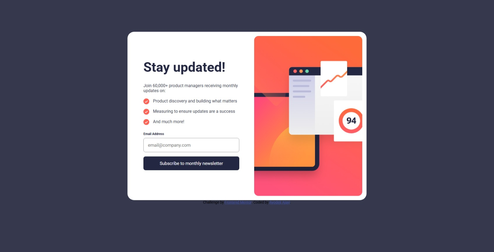

# Frontend Mentor - Newsletter sign-up form with success message solution

This is a solution to the [Newsletter sign-up form with success message challenge on Frontend Mentor](https://www.frontendmentor.io/challenges/newsletter-signup-form-with-success-message-3FC1AZbNrv). Frontend Mentor challenges help you improve your coding skills by building realistic projects. 

## Table of contents
- [Overview](#overview)
  - [The challenge](#the-challenge)
  - [Screenshot](#screenshot)
  - [Links](#links)
- [My process](#my-process)
  - [Built with](#built-with)
  - [What I learned](#what-i-learned)
  - [Continued development](#continued-development)
- [Author](#author)

## Overview

### The challenge

Users should be able to:

- Add their email and submit the form
- See a success message with their email after successfully submitting the form
- See form validation messages if:
  - The field is left empty
  - The email address is not formatted correctly
- View the optimal layout for the interface depending on their device's screen size
- See hover and focus states for all interactive elements on the page

### Screenshot

### Links

- Solution URL: [Github](https://github.com/bilegyr06/email-newsletter/tree/main/newsletter-sign-up-with-success-message-main)
- Live Site URL: [vercel](https://email-newsletter-lovat.vercel.app/)

## My process

### Built with

- Semantic HTML5 markup
- CSS custom properties
- Flexbox
- Mobile-first workflow

### What I learned

 - form validation 
 - How to style input tags
 - How to style li tags

### Continued development

I want to learn a little bit of backend development so I can be able to build fullstack websites.
## Author

- Website - [Ayodeji Ajayi](https://portfolio-web-phi-jade.vercel.app/)
- Frontend Mentor - [bilegyr06](https://www.frontendmentor.io/profile/bilegyr06)
- Instagram - [Deji](https://www.instagram.com/ay0deji.a/)

